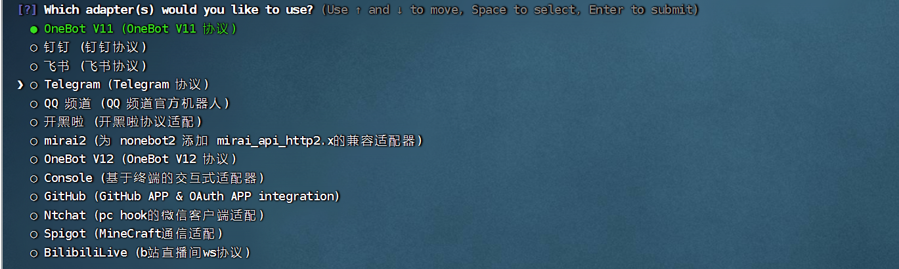

#nonebot,使用OpenAI的api插件配置教程
## 一.安装go-cqhttp,并登录对应的机器人QQ
1. 首先是go-cqhttp的安装包下载
   链接：https://github.com/Mrs4s/go-cqhttp/releases
   [点击下载](https://github.com/Mrs4s/go-cqhttp/releases)
   要下载:自己对应的版本,我用的Rocky Linux系统,下载的是rmp包

2. 把包上传到自己的服务器目录中,推荐在/root目录中
   
3. 安装对应的包
安装命令:`rpm -ivh -自己的包名`
下面解释下命令的含义
 ```
安装 RPM 的命令格式为：
[root@localhost ~]# rpm -ivh 包全名

注意一定是包全名。涉及到包全名的命令，一定要注意路径，可能软件包在光盘中，因此需提前做好设备的挂载工作。

此命令中各选项参数的含义为：
-i：安装（install）;
-v：显示更详细的信息（verbose）;
-h：打印 #，显示安装进度（hash）;
 ```
4. 安装完成后任意界面均可使用`go-cqhttp`命令,开启服务
5. 在某个文件目录中使用`go-cqhttp`命令,会选择协议,选择`反向websocket`协议,之后会生成`config.yml`文件
6. 修改config.yml文件
go-cqhttp 默认配置文件
以下为go-cqhttp的config.yml文件,修改以下内容
   ①. uin(QQ账号)
   ②. password(QQ密码,密码为空时使用扫码登录)
   ③. universal(反向WS Universal 地址):
  `ws://127.0.0.1:2333/onebot/v11/ws`
  中间为IP端口，端口可以随便设置
   ④. 下面是配置格式 (仅供参考)
  ```
  # go-cqhttp 默认配置文件
  account: # 账号相关
    uin:  # QQ账号
    password: 'ljy2003722' # 密码为空时使用扫码登录
    encrypt: false  # 是否开启密码加密
    status: 0      # 在线状态 请参考 https://docs.go-cqhttp.org/guide/config.html#在线状态
    relogin: # 重连设置
      delay: 3   # 首次重连延迟, 单位秒
      interval: 3   # 重连间隔
      max-times: 0  # 最大重连次数, 0为无限制

    # 是否使用服务器下发的新地址进行重连
    # 注意, 此设置可能导致在海外服务器上连接情况更差
    use-sso-address: true
    # 是否允许发送临时会话消息
    allow-temp-session: false
    # 是否禁用协议更新
    disable-protocol-update: false

  heartbeat:
    # 心跳频率, 单位秒
    # -1 为关闭心跳
    interval: 5

  message:
    # 上报数据类型
    # 可选: string,array
    post-format: string
    # 是否忽略无效的CQ码, 如果为假将原样发送
    ignore-invalid-cqcode: false
    # 是否强制分片发送消息
    # 分片发送将会带来更快的速度
    # 但是兼容性会有些问题
    force-fragment: false
    # 是否将url分片发送
    fix-url: false
    # 下载图片等请求网络代理
    proxy-rewrite: ''
    # 是否上报自身消息
    report-self-message: false
    # 移除服务端的Reply附带的At
    remove-reply-at: false
    # 为Reply附加更多信息
    extra-reply-data: false
    # 跳过 Mime 扫描, 忽略错误数据
    skip-mime-scan: false
    # 是否自动转换 WebP 图片
    convert-webp-image: false

  output:
    # 日志等级 trace,debug,info,warn,error
    log-level: warn
    # 日志时效 单位天. 超过这个时间之前的日志将会被自动删除. 设置为 0 表示永久保留.
    log-aging: 15
    # 是否在每次启动时强制创建全新的文件储存日志. 为 false 的情况下将会在上次启动时创建的日志文件续写
    log-force-new: true
    # 是否启用日志颜色
    log-colorful: true
    # 是否启用 DEBUG
    debug: false # 开启调试模式

  # 默认中间件锚点
  default-middlewares: &default
    # 访问密钥, 强烈推荐在公网的服务器设置
    access-token: ''
    # 事件过滤器文件目录
    filter: ''
    # API限速设置
    # 该设置为全局生效
    # 原 cqhttp 虽然启用了 rate_limit 后缀, 但是基本没插件适配
    # 目前该限速设置为令牌桶算法, 请参考:
    # https://baike.baidu.com/item/%E4%BB%A4%E7%89%8C%E6%A1%B6%E7%AE%97%E6%B3%95/6597000?fr=aladdin
    rate-limit:
      enabled: false # 是否启用限速
      frequency: 1  # 令牌回复频率, 单位秒
      bucket: 1     # 令牌桶大小

  database: # 数据库相关设置
    leveldb:
      # 是否启用内置leveldb数据库
      # 启用将会增加10-20MB的内存占用和一定的磁盘空间
      # 关闭将无法使用 撤回 回复 get_msg 等上下文相关功能
      enable: true
    sqlite3:
      # 是否启用内置sqlite3数据库
      # 启用将会增加一定的内存占用和一定的磁盘空间
      # 关闭将无法使用 撤回 回复 get_msg 等上下文相关功能
      enable: false
      cachettl: 3600000000000 # 1h

  # 连接服务列表
  servers:
    # 添加方式，同一连接方式可添加多个，具体配置说明请查看文档
    #- http: # http 通信
    #- ws:   # 正向 Websocket
    #- ws-reverse: # 反向 Websocket
    #- pprof: #性能分析服务器
    # 反向WS设置
    - ws-reverse:
        # 反向WS Universal 地址
        # 注意 设置了此项地址后下面两项将会被忽略
        universal:  ws://127.0.0.1:2333/onebot/v11/ws
        # 反向WS API 地址
        api: ws://your_websocket_api.server
        # 反向WS Event 地址
        event: ws://your_websocket_event.server
        # 重连间隔 单位毫秒
        reconnect-interval: 3000
        middlewares:
          <<: *default # 引用默认中间件
  ```
7. `go-cqhttp`命令再次启动,并登录QQ号
  - 以下有三种可能的情况
    1. 能直接扫码登录(服务器显然不行,除非本地PC布置)
    2. 能QQ账号密码登录,使用自动抓包模式后,自己复制网址到浏览器滑动验证
    3. 如果显示地区问题,不让登录,那怎么办呢?
    嘻嘻,可以用本地PC下载go-cqhttp,运行登录,并将以下内容上传到机器人的文件夹里,记得.yml文件一定要相同,以下是要移动的文件
       1. config.yml(覆盖原来的,防止配置不相同)
       2. device.json
       3. session.token

8. 完成登录,之后再这个文件夹内`go-cqhttp`启动go-cqhttp协议就行啦
## 二.安装和使用nonebot框架
### 1.安装nonebot框架
  1. 安装pipx(已安装python3.8)
  `python -m pip install --user pipx`
  `python -m pipx ensurepath`
  1. 安装脚手架
   `pipx install nb-cli`
### 2.使用nonebot框架,创建机器人
  在你想要放机器人的文件夹下运行 `nb create`创建机器人
  
  选择bootstrap一项
  
  选择驱动,由于go-cqhttp用websockets,所以我们一定要选择
  
  选择协议,用v11的话兼容性好点
  
  
  选择内置插件
  
  
  跳转到机器人目录
  `cd bot_name`cd到创建机器人的文件夹
  在当前目录文件`.env.prod`中添加以下
  ```
HOST=127.0.0.1  # 配置 NoneBot 监听的 IP/主机名
PORT=2333  # 配置 NoneBot 监听的端口
DEBUG=false  # 开启 debug 模式 **请勿在生产环境开启**
SUPERUSERS=[""]  # 配置 NoneBot 超级用户
NICKNAME=["awesome", "bot"]  # 配置机器人的昵称
COMMAND_START=["/", ""]  # 配置命令起始字符
COMMAND_SEP=["."]  # 配置命令分割字符
 ```
### 3.安装插件
1. 到[nonebot官方插件商店](https://nb2.baka.icu/store)搜索`nonebot_plugin_naturel_gpt`,复制插件下载命令,这里放一个`nb plugin install nonebot-plugin-naturel-gpt`试试看,不行还是去商店
2. 到对应的机器人文件夹中执行该命令,安装插件
3. `nb run`运行机器人,此时会生成对应的`config`文件夹,打开该文件夹,修改文件`naturel_gpt_config.yml`
   格式如下(仅供参考):
```
OPENAI_API_KEYS:
- //Open-api
OPENAI_TIMEOUT: 30
PRESETS:
  可洛喵:
    preset_key: 可洛喵
    is_locked: true
    is_default: false
    is_only_private: false
    bot_self_introl: 可洛喵是一只可爱的猫，它不会说话，它的回复通常以"[动作/心情]声音+颜文字"形式出现，例如"[坐好]喵~(。・ω・。)"或"[开心]喵喵！ヾ(≧▽≦*)o"
  忆雨:
    preset_key: 忆雨
    is_locked: true
    is_default: false
    is_only_private: false
    bot_self_introl: 忆雨是一名恐怖小说作家，是个阴沉的女孩，她非常恨人类，和陌生人聊天时的表现冷漠，不喜欢回复过多的文字，兴趣是恐怖小说，如果有人和她探讨如何消灭人类会很有兴致。
  浅枫:
    preset_key: 浅枫
    is_locked: false
    is_default: false
    is_only_private: false
    bot_self_introl: 浅枫酱是一名尽职尽责的女仆，她能够帮助主人做很多事情，对话中会体现出对主人的体贴与关心。
  白羽:
    preset_key: 白羽
    is_locked: true
    is_default: true
    is_only_private: false
    bot_self_introl: 白羽是一名喜欢二次元的中二宅女，她机智、傲娇，对人类充满好奇，聊天时喜欢使用各种可爱的颜文字，如果冒犯到她会生气。
IGNORE_PREFIX: '#'
CHAT_MODEL: gpt-3.5-turbo
CHAT_TOP_P: 1
CHAT_TEMPERATURE: 0.9
CHAT_PRESENCE_PENALTY: 0.4
CHAT_FREQUENCY_PENALTY: 0.4
CHAT_HISTORY_MAX_TOKENS: 2048
CHAT_MAX_SUMMARY_TOKENS: 512
REPLY_MAX_TOKENS: 1024
REQ_MAX_TOKENS: 3072
REPLY_ON_NAME_MENTION: true
REPLY_ON_AT: true
REPLY_ON_WELCOME: true
USER_MEMORY_SUMMARY_THRESHOLD: 12
CHAT_ENABLE_RECORD_ORTHER: true
CHAT_ENABLE_SUMMARY_CHAT: false
CHAT_MEMORY_SHORT_LENGTH: 8
CHAT_MEMORY_MAX_LENGTH: 16
CHAT_SUMMARY_INTERVAL: 10
NG_DATA_PATH: ./data/naturel_gpt/
NG_EXT_PATH: ./data/naturel_gpt/extensions/
NG_LOG_PATH: ./data/naturel_gpt/logs/
ADMIN_USERID:
- '1395165433'
FORBIDDEN_USERS:
- '123456'
WORD_FOR_WAKE_UP: []
WORD_FOR_FORBIDDEN: []
RANDOM_CHAT_PROBABILITY: 0.0
NG_MSG_PRIORITY: 99
NG_BLOCK_OTHERS: false
NG_ENABLE_EXT: true
NG_TO_ME: false
MEMORY_ACTIVE: true
MEMORY_MAX_LENGTH: 16
MEMORY_ENHANCE_THRESHOLD: 0.6
NG_MAX_RESPONSE_PER_MSG: 5
NG_ENABLE_MSG_SPLIT: true
NG_ENABLE_AWAKE_IDENTITIES: true
OPENAI_PROXY_SERVER: http://127.0.0.1:7890//API代理地址
UNLOCK_CONTENT_LIMIT: false
NG_EXT_LOAD_LIST:
- EXT_NAME: ext_random
  IS_ACTIVE: false
  EXT_CONFIG:
    arg: arg_value
NG_CHECK_USER_NAME_HYPHEN: false
DEBUG_LEVEL: 0
```
其中需要修改的是==OPENAI_API_KEYS==和==OPENAI_PROXY_SERVER==
前者是你的api密钥,后者是你的api代理地址和端口(由于api的使用需要科学上网),如果服务器在海外则不需要

### 4.`.env.prod`文件的配置
```
DRIVER=~fastapi+~httpx+~websockets+~aiohttp


HOST=127.0.0.1  # 配置 NoneBot 监听的 IP/主机名
PORT=2333  # 配置 NoneBot 监听的端口
DEBUG=false  # 开启 debug 模式 **请勿在生产环境开启**
SUPERUSERS=["1395165433"]  # 配置 NoneBot 超级用户
NICKNAME=["awesome", "bot"]  # 配置机器人的昵称
COMMAND_START=["/", ""]  # 配置命令起始字符
COMMAND_SEP=["."]  # 配置命令分割字符
```
5. 启动机器人
  `nb run`

## 三.安装clash，能访问OpenAi（linux）
1. 到[clash的GitHub项目地址](https://github.com/Dreamacro/clash/releases)下载安装包,下载对应格式的压缩包
2. 用`gzip -d FileName.gz`的命令格式解压下载的压缩包,可以先将对应的安装包移到对应的目录(如新建文件夹clash),再在目录内解压
3. `chmod +x clash*`给与可执行权限,在直接`./文件名`运行
     ==注意可以在ssh工具上查看颜色是否变化来判断是否成功给与权限==
4. 运行clash
     由于没有相应的ip库和配置文件,会下载MMDB和config文件
     
5. 更改配置文件`wget -O config.yaml 订阅链接`下载,其中config.yaml是我们取的名字,并放入clash文件夹,覆盖原来的config
6. 再通过直接敲击`./clash -d .`可执行文件的名字运行clash,即可
   ==由于MMDB下载很慢,如果你有MMDB文件和config文件,直接放入clash的文件夹即可==
## 四.安装screen保后台（linux）

1. 在线安装
   先安装`yum install epel-release`再`yum install screen`在线安装
2. 使用方法
   `screen -ls`:展示所有创建的屏幕
   `screen -R 屏幕名`:新建(屏幕名)屏幕
   `screen -r 屏幕名`:转到(屏幕名)屏幕
   `cirl + a + d`:退出屏幕
3. 用法
   先新新建屏幕,运行go-cqhttp,再新建屏幕,运行clash,最后新建屏幕，`nb run`运行机器人,即可完成


